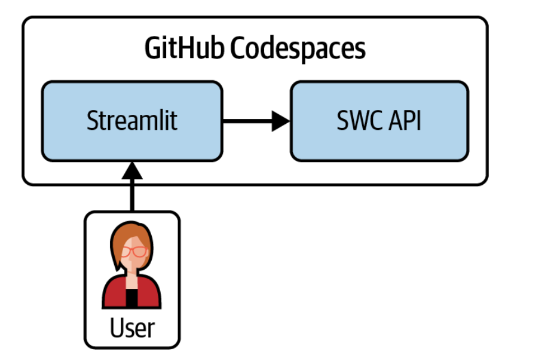
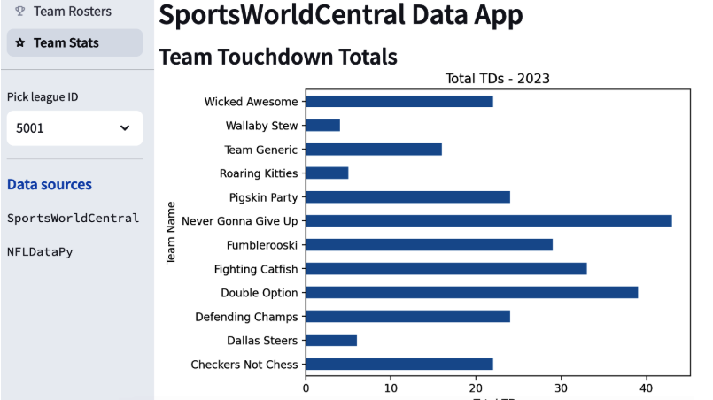

# Analytics Project: Data Pipelines with APIs and displaying using Streamlit.

This project demonstrates how to build data pipelines that consume APIs and maintain up-to-date data for analytics products. Below is Architecture Diagram of project



## Overview

The project explores the following topics:

*   Creating a data app with Streamlit
*   Consuming data from a custom-built API (SportsWorldCentral)
*   Combining API data with data from a Python library (NFL data)
*   Building a data pipeline to update a database from an API
*   Orchestrating the data pipeline with Apache Airflow

## Project Structure
 ├─ .venv/ # Python virtual environment (ignored by Git)
 
 ├─ airflow/ # Apache Airflow DAGs and configuration
 
 ├─ api/ # FastAPI application (SportsWorldCentral API)
 
 ├─ notebooks/ # General notebooks 
 
 ├─ streamlit/ # Streamlit application code
 
 ├─ .gitignore # Specifies intentionally untracked files that Git should ignore
 
 └─ LICENSE # Project license (e.g., MIT License)
 
 └─ README.md # This file

## Technologies Used

*   **Workflow Orchestration:**  [Apache Airflow](https://airflow.apache.org/)
    [](https://airflow.apache.org/)
*   **API Development:** [FastAPI](https://fastapi.tiangolo.com/)
    [](https://fastapi.tiangolo.com/)
*   **HTTP Client:** [httpx](https://www.python-httpx.org/)
    [](https://www.python-httpx.org/)
*   **Data Validation:** [Pydantic](https://pydantic-docs.helpmanual.io/)
    [](https://pydantic-docs.helpmanual.io/)
*   **Data Visualization:** [Streamlit](https://streamlit.io/)


## Setup

1.  **Clone the Repository:**

    ```bash
    git clone [YOUR_REPOSITORY_URL]
    ```
 

2.  **Create and Activate Virtual Environment:**

    ```bash
    python -m venv .venv
    .venv\Scripts\activate  # On Windows
    ```

3.  **Install Dependencies:**

    ```bash
    pip3 install -r requirements.txt  
    ```

4.  **Configure Apache Airflow:**

    *   Install Airflow.
    *   Set up the Airflow database (as per Airflow documentation).
    *  This project uses DAGs to update a SQLite database with data from the SWC API.

5.  **Run the FastAPI Application (SportsWorldCentral API):**

    *   Navigate to the `api/` directory.
    ```bash
    run fast-api main.py 
    ```
    *   update base_url after running api and update in Streamlit

6.  **Run the Streamlit Application:**

    *   Navigate to the `streamlit/` directory.
    *   Run: `streamlit run your_streamlit_app.py`
  
    
## Result




## Usage
*   Use the FastAPI to serve custom made Api.
*   Examine the Airflow DAGs in the `airflow/` directory to understand how the data pipeline is orchestrated to update SQLite database(i.e Analytics Database).
*   Run the Streamlit application to interact with the data and visualizations.


## Summary

This project demonstrates how to leverage APIs to create data pipelines for analytics products. It covers key concepts such as API consumption, data transformation, workflow orchestration with Apache Airflow, and interactive data visualization with Streamlit. By completing this I had gained  practical experience in building end-to-end data solutions that integrate with external data sources.
