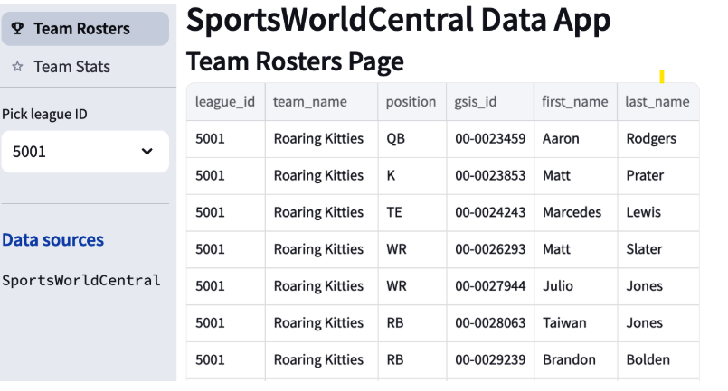

# Analytics Project: Data Pipelines with APIs

This project demonstrates how to build data pipelines that consume APIs and maintain up-to-date data for analytics products.  



## Overview

The project explores the following topics:

*   Creating a data app with Streamlit
*   Consuming data from a custom-built API (SportsWorldCentral)
*   Combining API data with data from a Python library (NFL data)
*   Building a data pipeline to update a database from an API
*   Orchestrating the data pipeline with Apache Airflow

## Project Structure
 ├─ .venv/ # Python virtual environment (ignored by Git)
 
 ├─ airflow/ # Apache Airflow DAGs and configuration
 
 ├─ api/ # FastAPI application (SportsWorldCentral API)
 
 ├─ chapter10/ # Source code and notebooks for Chapter 10 (Data Pipelines)
 
 │  └─ notebooks/ # Jupyter notebooks for exploration and experimentation
 
 ├─ notebooks/ # General notebooks 
 
 ├─ streamlit/ # Streamlit application code
 
 ├─ .gitignore # Specifies intentionally untracked files that Git should ignore
 
 └─ LICENSE # Project license (e.g., MIT License)
 
 └─ README.md # This file

## Technologies Used

*   **Workflow Orchestration:**  [Apache Airflow](https://airflow.apache.org/)
    [](https://airflow.apache.org/)
*   **API Development:** [FastAPI](https://fastapi.tiangolo.com/)
    [](https://fastapi.tiangolo.com/)
*   **HTTP Client:** [httpx](https://www.python-httpx.org/)
    [](https://www.python-httpx.org/)
*   **Data Validation:** [Pydantic](https://pydantic-docs.helpmanual.io/)
    [](https://pydantic-docs.helpmanual.io/)
*   **Data Visualization:** [Streamlit](https://streamlit.io/)


## Setup

1.  **Clone the Repository:**

    ```bash
    git clone [YOUR_REPOSITORY_URL]
    cd analytics-project/api
    ```

2.  **Create and Activate Virtual Environment:**

    ```bash
    python -m venv .venv
    source .venv/bin/activate  # On Linux/macOS
    .venv\Scripts\activate  # On Windows
    ```

3.  **Install Dependencies:**

    ```bash
    pip install -r requirements.txt  
    ```

4.  **Configure Apache Airflow:**

    *   Install Airflow.
    *   Set up the Airflow database (as per Airflow documentation).
    *   Copy the DAG files from the `airflow/` directory to your Airflow DAGs folder.
    *   Configure Airflow connections for any external APIs or databases used in the project.

5.  **Run the FastAPI Application (SportsWorldCentral API):**

    *   Navigate to the `api/` directory.
    *   Run: `uvicorn main:app --reload`

6.  **Run the Streamlit Application:**

    *   Navigate to the `streamlit/` directory.
    *   Run: `streamlit run your_streamlit_app.py`

## Usage

*   Explore the Jupyter notebooks in the `chapter10/notebooks/` directory to understand the data analysis and API consumption steps.
*   Examine the Airflow DAGs in the `airflow/` directory to understand how the data pipeline is orchestrated.
*   Run the Streamlit application to interact with the data and visualizations.
*   Use the FastAPI to serve custom made APi.

## Summary

This project demonstrates how to leverage APIs to create data pipelines for analytics products. It covers key concepts such as API consumption, data transformation, workflow orchestration with Apache Airflow, and interactive data visualization with Streamlit. By completing this project, you'll gain practical experience in building end-to-end data solutions that integrate with external data sources.
